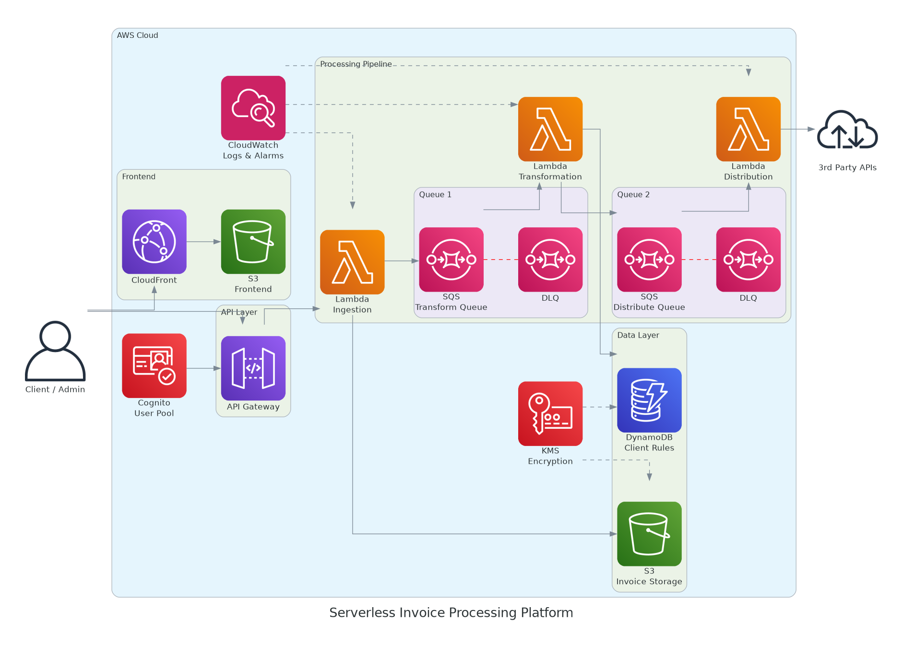

# Serverless Invoice Processing Platform

A production-ready serverless platform that receives OCR'd invoices via API Gateway, applies client-specific transformation rules, and distributes the results to third-party APIs — all on AWS with zero servers to manage.


---

## Architecture



---

## How it works

```
Client → API Gateway (Cognito auth)
           ↓
      Lambda Ingestion → S3 (raw invoice)
           ↓
      SQS Transform Queue (+ DLQ)
           ↓
      Lambda Transformation → DynamoDB (client rules) → S3 (transformed invoice)
           ↓
      SQS Distribute Queue (+ DLQ)
           ↓
      Lambda Distribution → 3rd Party APIs (with retry)
```

---

## What this provisions

| Resource | Purpose |
|---|---|
| API Gateway | Authenticated REST endpoint for invoice ingestion |
| Cognito User Pool | OAuth2 authentication for clients and admins |
| Lambda — Ingestion | Validates, stores to S3, enqueues to SQS |
| Lambda — Transformation | Fetches client rules from DynamoDB, transforms invoice |
| Lambda — Distribution | Delivers transformed invoice to third-party APIs with retry |
| SQS (×2) | Decoupled queues between pipeline stages |
| SQS DLQ (×2) | Dead-letter queues for failed processing |
| DynamoDB | Versioned client-specific transformation rules |
| S3 — Invoice Storage | Raw and transformed invoice storage |
| S3 — Frontend | Static website hosting |
| CloudFront | CDN for the frontend web interface |
| CloudWatch | Dashboard, Lambda error alarms, DLQ alarms |

---

## Prerequisites

| Tool | Version |
|---|---|
| Terraform | >= 1.9 |
| AWS CLI | >= 2.x |
| Python | >= 3.13 |
| AWS account | With permissions to create Lambda, API Gateway, DynamoDB, S3, SQS, Cognito |

---

## Deployment

### 1. Create the S3 backend bucket

```bash
export REGION=eu-west-1
export BUCKET_NAME=your-unique-tfstate-bucket

aws s3api create-bucket \
  --bucket "$BUCKET_NAME" \
  --region "$REGION" \
  --create-bucket-configuration LocationConstraint="$REGION"

aws s3api put-bucket-versioning \
  --bucket "$BUCKET_NAME" \
  --versioning-configuration Status=Enabled
```

### 2. Configure variables

```bash
cp infra/terraform.tfvars.example infra/terraform.tfvars
# Edit with your values
```

### 3. Deploy

```bash
cd infra
export ENV=dev

terraform init \
  -backend-config="bucket=$BUCKET_NAME" \
  -backend-config="key=$ENV/terraform.tfstate" \
  -backend-config="region=$REGION"

terraform plan -out=plan.tfplan
terraform apply plan.tfplan
```

### 4. Configure the frontend

After `terraform apply`, copy the outputs to `front/.env`:

```bash
echo "VITE_COGNITO_USER_POOL_ID=$(terraform output -raw cognito_user_pool_id)" >> ../front/.env
echo "VITE_COGNITO_CLIENT_ID=$(terraform output -raw cognito_client_id)" >> ../front/.env
echo "VITE_API_URL=$(terraform output -raw api_url)" >> ../front/.env
```

### 5. Destroy

```bash
terraform destroy
```

---

## File structure

```
.
├── infra/
│   ├── main.tf               # Root module — wires all modules together
│   ├── provider.tf           # Terraform version, AWS provider, S3 backend
│   ├── variables.tf          # Input variables
│   ├── output.tf             # Outputs (API URL, CloudFront URL, etc.)
│   └── modules/
│       ├── api-gateway/      # REST API + Cognito authorizer + Lambda integration
│       ├── cognito/          # User pool + app client
│       ├── lambda/           # Reusable Lambda module (all 3 functions)
│       ├── sqs/              # Reusable SQS queue + DLQ module
│       ├── dynamodb/         # Client rules table
│       ├── s3/               # Reusable S3 bucket module
│       ├── cdn/              # CloudFront distribution
│       └── monitoring/       # CloudWatch dashboard + alarms
├── lambdas/
│   ├── ingestion/main.py     # Validates invoice, stores to S3, enqueues to SQS
│   ├── transformation/main.py # Applies DynamoDB rules, enqueues to SQS
│   └── distribution/main.py  # Delivers to third-party APIs with retry
├── front/                    # React + Vite frontend (Cognito auth)
└── .github/
    └── workflows/
        └── terraform.yml     # CI: fmt, validate, tflint, trivy
```

---

## CI Pipeline

| Job | Tool | What it checks |
|---|---|---|
| Format & Validate | `terraform fmt` + `terraform validate` | Code style and correctness |
| Lint | TFLint | Best practices and deprecations |
| Security | Trivy | CRITICAL and HIGH misconfigurations |

---

## FinOps — Cost estimate

Running in `eu-west-1` at 5000 invoices/hour:

| Resource | Approx. monthly cost |
|---|---|
| Lambda (3 functions × 5000/hr) | ~$2 |
| SQS (2 queues × ~3.6M msg/month) | ~$3 |
| DynamoDB (on-demand) | ~$1 |
| S3 (storage + requests) | ~$2 |
| API Gateway | ~$18 |
| CloudFront | ~$1 |
| CloudWatch | ~$3 |
| **Total** | **~$30/month** |

> Serverless architecture makes this 5× cheaper than an equivalent EC2-based setup.

---

## Security

- All API endpoints protected by Cognito OAuth2
- S3 buckets have public access blocked and server-side encryption enabled
- DynamoDB has encryption at rest and point-in-time recovery enabled
- IAM roles follow least-privilege principle
- CloudFront enforces HTTPS with redirect
